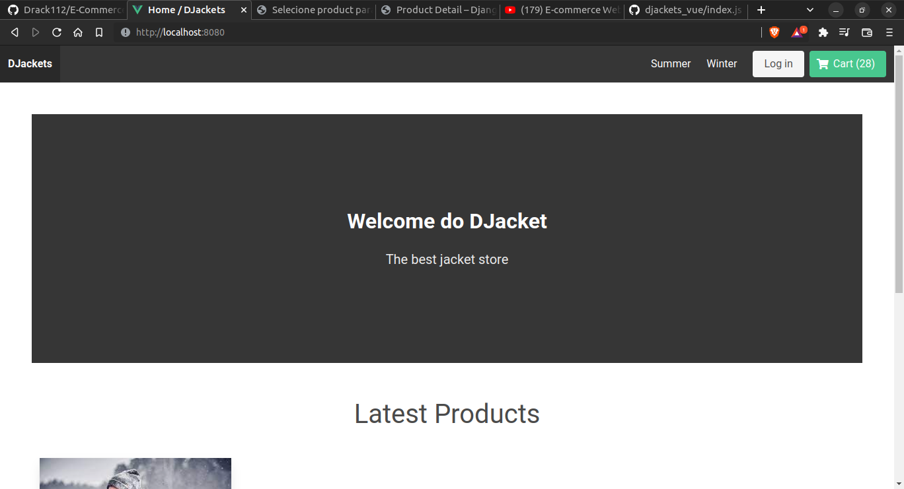
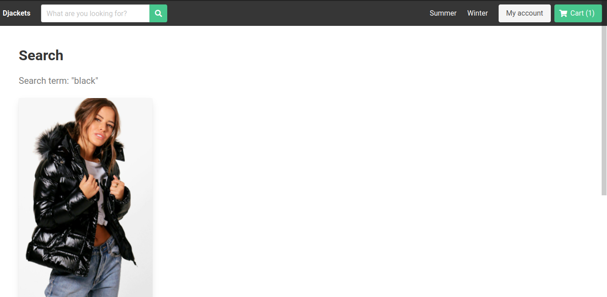
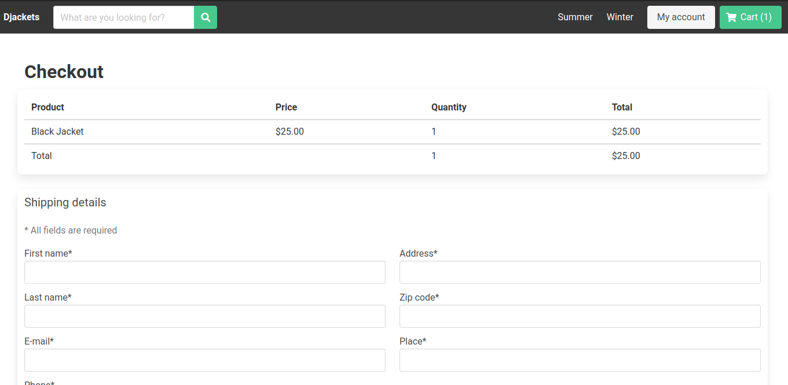

<div align="center">
  <h1>E-Commerce com Vue e Django 🛒</h1>
  <br>
  <div align="center">
    <a href="#sobre">Sobre</a> |
    <a href="#tecnologias">Tecnologias</a> |
    <a href="#run">Rodando o projeto</a>
  </div>
</div>

<a id="sobre"></a>

Teste de realizar a interface de aplicação do E-Commerce com Vue utilizando o framework VueJS com utilitários de CSS e SCSS. A aplicação em si foi desenvolvida com JavaScript em vez de TypeScript por fins de testes.

<div align="center">
  <strong>Tela de Home Screen</strong>
  
  <div align="center">
    <strong>Tela da roupas</strong>
    
  </div>
  <div align="center">
    <strong>Tela de Compra</strong>
    
  </div>
  <a id="tecnologias"></a>
</div>

## :computer: Tecnologias

O projeto foi desenvolvido usando as tecnologias:

<div align="center">
  
  
  
  
</div>

<a id="run"></a>

## :running: Rodando o projeto

### 💻 Pré-requisitos

Antes de começar, verifique se você atendeu aos seguintes requisitos:

- Você instalou a versão mais recente de `< Docker/ NodeJS >`
- Você tem uma máquina `< Windows / Linux / Mac >`.
- Você possui um `< Editor de código ou IDE / Gerenciador de banco de dados >`.

## Serviços necessários antes de rodar a aplicação:

Não se esqueça de rodar o **_backend_** da aplicação que está no mesmo repositório.

Lembre-se de pegar as suas chaves de API nos serviços da **[Cloudinary](https://www.googleadservices.com/pagead/aclk?sa=L&ai=DChcSEwjl49bn4oX3AhXPQUgAHdW8AFAYABAAGgJjZQ&ohost=www.google.com&cid=CAASJeRoZficLapyBYRC5pWQ6cgFAKUh-DeA2yIPtwULbUZEPsb5Evg&sig=AOD64_3SQrHCVZaf9Ts2mVKRuoGkzAm4Dw&q&adurl&ved=2ahUKEwid3c7n4oX3AhWArJUCHbZRAH4Q0Qx6BAgDEAE)** e do **[Stripe](https://www.googleadservices.com/pagead/aclk?sa=L&ai=DChcSEwijlrD54oX3AhUvQUgAHQb7CAsYABAAGgJjZQ&ohost=www.google.com&cid=CAASJeRopwqWu91WWsvPhM4UKeVdBrRdLP22hWD2ajMnUqih0kZrdnc&sig=AOD64_0Ww0E5pwd2EtlWshd1Y1RIipL_mg&q&adurl&ved=2ahUKEwiutan54oX3AhUNjZUCHaMFAqsQ0Qx6BAgDEAE).**

## Se lembre de ter o Docker :ocean:

### UM comando só:

```bash
$ docker-compose up
```

### Manualmente:

Instale o que é obrigatário:

```bash
$ npm install
# ou
$ yarn install
```

Por segurança crie a build:

```bash
$ npm run build
# ou
$ yarn build
```

Agora execute os servidor:

```bash
$ npm run serve
# ou
$ yarn serve
```

#### _Sinta-se livre para colaborar, toda ajuda é bem vinda ;)_

 <br/>
